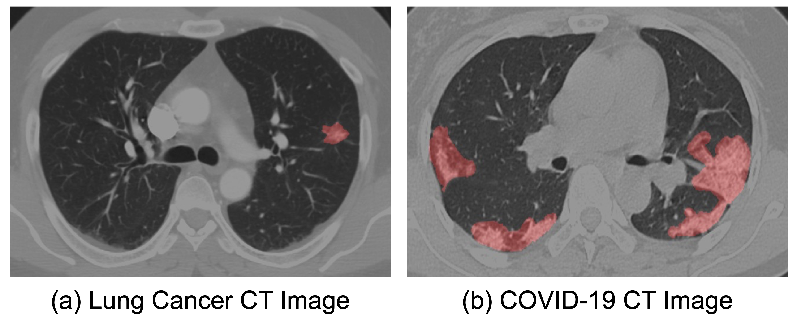
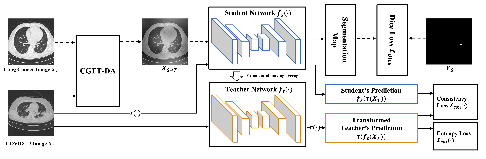

<p align="center">
  
</p>
<p align="center">
  Comparison of the pulmonary nodule and COVID-19 infection in CT images. (a) shows a typical nodule of lung cancer and (b) illustrates the infection of a COVID-19 confirmed case. The nodule and infection are marked with red. In terms of distribution, COVID-19 presents as a bilateral, patchy infection, while early-stage lung cancer is unilateral and oval in shape. While there is also a clear difference in intensity due to the use of different scanners, scanning protocols, and subject populations.
  <br>  Here comes the question: "How to effeiciently utilize labeled lung cancer CT data for the COVID-19 infection segmentation task?"
</p>


# Abstract

Automatic segmentation of infected regions in computed tomography (CT) images is necessary for the initial diagnosis of COVID-19. Deep-learning-based methods have the potential to automate this task but require a large amount of data with pixel-level annotations. Training a deep network with annotated lung cancer CT images, which are easier to obtain, can alleviate this problem to some extent. However, this approach may suffer from a reduction in performance when applied to unseen COVID-19 images during the testing phase, caused by the difference in the image intensity and object region distribution between the training set and test set. In this paper, we propose a novel unsupervised method for COVID-19 infection segmentation that aims to learn the domain-invariant features from lung cancer and COVID-19 images to improve the generalization ability of the segmentation network for use with COVID-19 CT images. First, to address the intensity difference, we proposed a novel data augmentation module based on Fourier Transform, which transfers the annotated lung cancer data into the style of COVID-19 image. Secondly, to reduce the distribution difference, we design a teacher-student network to learn rotation-invariant features for segmentation. The experiments demonstrate that even without getting access to the annotations of the COVID-19 CT images during the training phase, the proposed network can achieve a state-of-the-art segmentation performance on COVID-19 infection.

# Overview

<p align="center">
  
</p>
<p align="center">
 Our network consists of a CGFT-DA module, a student network, and a teacher network. The dashed lines and solid lines represent the data flow for the lung cancer images and COVID-19 images, respectively. The student network is trained by the weighted combination of dice loss, consistency loss, and entropy loss. The weights of the teacher network are the exponential moving average of that of the student network. τ(·) represents an elastic transformation operation with the same parameters in every iteration.
</p>


In this paper, we consider COVID-19 infection segmentation in the context of the wide availability of lung cancer CT images with annotations, the limited availability of unlabeled COVID-19 CT images, and the difference between these two domains. Our motivation is that the features learned from pulmonary nodules in lung cancer CT can be used for the segmentation of COVID-19 infection, making it possible to construct an unsupervised COVID-19 infection segmentation method. For our segmentation network, we design a novel COVID-19 style guided Fourier transform-based data augmentation method (CGFT-DA) and a training scheme to align these two datasets. In order to address the intensity difference, we transfer the lung cancer CT images into the style of COVID-19 CT images with the designed CGFT-DA module based on Fourier transform, which replaces the low-level frequency information of the lung cancer CT images with that of COVID-19 CT images. The output of the CGFTDA module will keep the same semantic information with the lung cancer image but in the COVID-19 image style. Since the lung cancer CT images are labeled at pixel-level, the transferred images and corresponding annotations can be used to train the base segmentation network. To overcome the distribution difference, we introduce a teacher-student learning paradigm to achieve robust features learning. We treat our base segmentation network as a student network and introduce another teacher network, and then impose the same elastic transformation on the input to the student network and the output of the teacher network, respectively. The output predictions of these two networks are forced to be consistent. We validate the effectiveness of our proposed method with public COVID-19 CT images. Experimentally, it outperforms various competing state-of-the-art approaches.


# COVID-19 CT Infection Segmentation Results
<p align="center">
  
</p>
<p align="center">
Qualitative results for two-class segmentation task. Columns 1 and 2 present the input real COVID-19 CT images and corresponding ground truth, while Column 6 is the segmentation result of our proposed method. The first to last rows are the results when taking ground-glass opacity (a), consolidation (b), infection (c) and the lung (d) as the segmentation object, respectively.
</p>

<p align="center">
  
</p>
<p align="center">
Qualitative results for multi-class segmentation task. Columns 1 and 2 show the input real COVID-19 CT images and corresponding ground truth, in which the ground-glass opacity is marked in blue, consolidation is marked in green, and the lung is marked in red. Columns 7 is the segmentation result for our proposed method.
</p>

# Acknowlegements
This research work is supported by the Air Force Office of Scientific Research (award number FA2386-19-1-4001).

# Citation
```
@article{chen2022unsupervised,
  title={Unsupervised domain adaptation based COVID-19 CT infection segmentation network},
  author={Chen, Han and Jiang, Yifan and Loew, Murray and Ko, Hanseok},
  journal={Applied Intelligence},
  volume={52},
  number={6},
  pages={6340--6353},
  year={2022},
  publisher={Springer}
}
```
